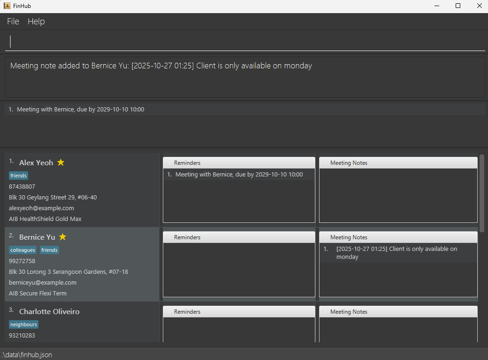

# FinHub User Guide

FinHub is a **desktop app for insurance agents to manage clients. It helps them to better organise all information related to each client, optimised for use via a Command Line Interface** (CLI) while
still having the benefits of a Graphical User Interface (GUI). If you can type fast, FinHub can get your client management
tasks done faster than traditional GUI apps.

<box type="tip">

**Tip:** In addition to managing standard contact fields, FinHub also allows you to add reminders and meeting notes to
each client. You also have the option to star or archive clients for better client organisation.
</box>

<box type="tip">

**Tip:** Want to skip straight to the available commands?
 
[Click Here for the Command Summary!](#command-summary)
</box>

--------------------------------------------------------------------------------------------------------------------

## Target User and Assumptions Made

Our target users are insurance agents who:
- manage many existing and potential clients.
- may need to find contacts of particular clients.
- have to keep track of many meetings with clients.
- need to keep track of a huge amount of client information.
- have client of different priorities.
- can type fast and prefer typing commands to interacting with UI.
- are equipped with basic CLI knowledge

 

--------------------------------------------------------------------------------------------------------------------

<!-- * Table of Contents -->
## Table of Contents
* [1. Quick Start](#1-quick-start)
* [2. Features](#2-features)
  * [2.1 General Commands](#2-1-general-commands)
    * [2.1.1 Viewing Help : `help`](#2-1-1-viewing-help-help)
    * [2.1.2 Listing all Clients : `list`](#2-1-2-listing-all-clients-list)
    * [2.1.3 Listing all active Clients : `activelist`](#2-1-3-listing-all-active-clients-list)
    * [2.1.4 Listing all archived Clients : `archivelist`](#2-1-4-listing-all-archived-clients-list)
    * [2.1.5 Clear all Entries : `clear`](#2-1-5-clearing-all-entries-clear)
    * [2.1.6 Exiting the Program : `exit`](#2-1-6-exiting-the-program-exit)
  * [2.2 Managing Clients](#2-2-managing-clients)
    * [2.2.1 Adding a Client : `add`](#2-2-1-adding-a-client-add)
    * [2.2.2 Deleting a Client : `delete`](#2-2-2-deleting-a-client-delete)
    * [2.2.3 Editing a Client : `edit`](#2-2-3-editing-a-client-edit)
    * [2.2.4 Locating a Client : `find`](#2-2-4-locating-clients-by-name-find)
    * [2.2.5 Staring a Client : `star`](#2-2-5-starring-a-client-star)
    * [2.2.6 Removing Star of a Client : `unstar`](#2-2-6-removing-star-status-of-a-client-unstar)
    * [2.2.7 Archiving a Client : `archive`](#2-2-7-archiving-a-client-archive)
    * [2.2.8 Unarchiving a Client : `unarchive`](#2-2-8-unarchiving-a-client-unarchive)
  * [2.3 Reminders](#2-2-3-reminders)
    * [2.3.1 Adding a Reminder : `reminder`](#2-3-1-adding-a-reminder-reminder)
    * [2.3.2 Deleting a Reminder : `rDelete`](#2-3-2-deleting-a-reminder-rdelete)
    * [2.3.3 Editing a Reminder : `rEdit`](#2-3-3-editing-a-reminder-redit)
  * [2.4 Meeting Notes](#2-4-meeting-notes)
    * [2.4.1 Adding a Meeting Note : `note`](#2-4-1-adding-a-meeting-note-note)
    * [2.4.2 Deleting a Meeting Note : `nDelete`](#2-4-2-deleting-a-meeting-note-ndelete)
* [3. Data and Storage](#3-data-and-storage)
  * [3.1 Saving the Data](#3-1-saving-the-data)
  * [3.2 Editing the Data File](#3-2-editing-the-data-file)
  * [3.3 Transferring Data to another Computer](#3-3-transferring-data-to-another-computer)
* [4. FAQ](#4-faq)
* [5. Known Issues](#5-known-issues)
* [6. Command Summary](#6-command-summary)

 

--------------------------------------------------------------------------------------------------------------------

## 1. Quick Start

1. Make sure you have Java `17` or above installed in your computer. 
   **Mac users:** Make sure you have the precise JDK version
   listed [here](https://se-education.org/guides/tutorials/javaInstallationMac.html).

1. Download the latest `.jar` file from [here](https://github.com/AY2526S1-CS2103T-F09-1/tp/releases).

1. Copy the file to the folder you want to use as the _home folder_ for FinHub.

1. Open a command terminal, `cd` into the folder you put the jar file in, and use the `java -jar FinHub.jar`
   command to run the application. 
   A window like the one below will appear after a few seconds. Note how the app contains some sample data. 
   

1. Type the command in the command box and press Enter to execute it. e.g. typing **`help`** and pressing Enter will
   open the help window. 
   Some example commands you can try:

    * `list` : Lists all contacts.

    * `add n/John Doe p/98765432 e/johnd@example.com a/John street, block 123, #01-01 ip/AIB Premium Plan` : Adds a contact named `John Doe`
      to FinHub.

    * `delete 3` : Deletes the 3rd contact shown in the current list.

    * `clear` : Deletes all contacts.

    * `exit` : Exits the app.

    * `reminder 2 h/Meeting on Friday d/2026-04-24 16:00` : Adds a reminder with header `Meeting on Friday` to client
      index 2.

1. Refer to the [Features](#features) below for details of each command.

 

--------------------------------------------------------------------------------------------------------------------

## 2. Features

<box type="info>

**General remarks about the command formats:** 

* You need to supply the parameters which are in `UPPER_CASE`. 
  e.g. in `add n/NAME`, `NAME` is a parameter which can be used as `add n/John Doe`.

* Items in square brackets are optional. 
  e.g `n/NAME [t/TAG]` can be used as `n/John Doe t/friend` or as `n/John Doe`.

* Items with `…`​ after them can be used multiple times including zero times. 
  e.g. `[t/TAG]…​` can be used as ` ` (i.e. 0 times), `t/friend`, `t/friend t/family` etc.

* Parameters can be in any order. 
  e.g. if the command specifies `n/NAME p/PHONE_NUMBER`, `p/PHONE_NUMBER n/NAME` is also acceptable.

* Extra parameters for commands that do not take in parameters (such as `help`, `list`, `exit` and `clear`) will be
  ignored. 
  e.g. if the command specifies `help 123`, it will be interpreted as `help`.

* If you are using a PDF version of this document, be careful when copying and pasting commands that span multiple lines
  as space characters surrounding line-breaks may be omitted when copied over to the application.
  </box>

* Any indices i.e. `CLIENT_INDEX`, `REMINDER_INDEX` and `MEETING_NOTE_INDEX`
  **must be positive integers** 1, 2, 3, …​

### 2.1 General Commands

#### 2.1.1 Viewing help : `help`

Displays a message explaining how to access the help page.

Format: `help`

 

--------------------------------------------------------------------------------------------------------------------

#### 2.1.2 Listing all clients : `list`

Displays a list of all clients in FinHub.

Format: `list`

 

--------------------------------------------------------------------------------------------------------------------

#### 2.1.3 Listing active clients : `activelist`

Displays a list of all active clients in FinHub.

Format: `activelist`

 

--------------------------------------------------------------------------------------------------------------------

#### 2.1.4 Listing archive clients : `archivelist`

Displays a list of all archived clients in FinHub.

Format: `archivelist`

 

--------------------------------------------------------------------------------------------------------------------

#### 2.1.5 Clearing all entries : `clear`

Clears all entries in FinHub.

Format: `clear`

 

--------------------------------------------------------------------------------------------------------------------

#### 2.1.6 Exiting the program : `exit`

Exits FinHub.

Format: `exit`

 

--------------------------------------------------------------------------------------------------------------------

### 2.2 Managing Clients

#### 2.2.1 Adding a client : `add`

Adds a client to FinHub.

Format: `add n/NAME p/PHONE_NUMBER e/EMAIL a/ADDRESS ip/INSURANCE_POLICY [t/TAG]…​`

<box type="tip">

**Tip:** A client can have any number of tags (including 0)
</box>

Examples:

* `add n/John Doe p/98765432 e/johnd@example.com a/John street, block 123, #01-01 ip/AIB Premium Plan`
* `add n/Betsy Crowe t/friend e/betsycrowe@example.com a/Palace street, block 456, #03-03 p/1234567 t/classmate ip/AIB LifePlan`

 

--------------------------------------------------------------------------------------------------------------------

#### 2.2.2 Deleting a client : `delete`

Deletes a specified client from FinHub.

Format: `delete CLIENT_INDEX`

* Deletes the client at the specified `CLIENT_INDEX`.
* `CLIENT_INDEX` refers to the index number of the client shown in the displayed clients list.

Examples:

* `list` followed by `delete 2` deletes the 2nd client in the displayed clients list.
* `find alex` followed by `delete 1` deletes the 1st client in the results of the `find` command.

 

--------------------------------------------------------------------------------------------------------------------

#### 2.2.3 Editing a client : `edit`

Edits an existing client in FinHub.

Format: `edit CLIENT_INDEX [n/NAME] [p/PHONE] [e/EMAIL] [a/ADDRESS] [t/TAG]…​ [ip/INSURANCE_POLICY]`

* Edits the client at the specified `CLIENT_INDEX`.
* `CLIENT_INDEX` refers to the index number of the client shown in the displayed clients list.
* At least one of the optional fields must be provided.
* Existing values will be updated to the input values.
* When editing tags, the existing tags of the client will be removed i.e adding of tags is not cumulative.
* You can remove all the client’s tags by typing `t/` without specifying any tags after it.

Examples:
* `edit 1 p/91234567 ip/Health policy` Changes the 1st client’s `PHONE` to `91234567`
  and `INSURANCE_POLICY` to `Health policy` respectively.
* `edit 2 n/Alex Tan t/` Changes the 2nd client’s name to `Alex Tan` and clears all their existing tags.

 

--------------------------------------------------------------------------------------------------------------------

#### 2.2.4 Locating clients by name : `find`

Finds clients whose names contain any of the given keywords.

Format: `find KEYWORD [MORE_KEYWORDS]`

* The search is case-insensitive.
* The order of the keywords does not matter.
* Only the name is searched.
* Clients matching at least one keyword will be returned (i.e. `OR` search).

Examples:

* `find ale` returns `Alex Yeoh`.
* `find Yu Ber` returns `Bernice Yu`
* `find Alex David` returns `Alex Yeoh`, `David Li` 
  

 

--------------------------------------------------------------------------------------------------------------------

#### 2.2.5 Starring a client : `star`

Stars the specified client in FinHub. Starred clients will have a star displayed next to their name, and will be bumped
to the top of the displayed clients lists along with other starred clients.

Format: `star CLIENT_INDEX`

* Stars the client at the specified `CLIENT_INDEX`.
* `CLIENT_INDEX` refers to the index number of the client shown in the displayed clients list.
* Only one client can be starred at a time.

Examples:

* `list` followed by `star 1` stars the 1st client in the displayed clients list
* `list` followed by `star 2` stars the 2nd client in the displayed clients list
* `find Alex` followed by `star 1` stars the 1st client in the results of the `find` command.

<box type="tip" seamless>

**Tip:** You can use this feature to mark important clients as favourites!
</box>

 

--------------------------------------------------------------------------------------------------------------------

#### 2.2.6 Removing star status of a client : `unstar`

Removes the starred status of a specified client in FinHub.

Format: `unstar CLIENT_INDEX`

* Removes the starred status of the client at the specified `CLIENT_INDEX`.
* `CLIENT_INDEX` refers to the index number of the client shown in the displayed clients list.
* You can only remove the star status from one client at a time.

Examples:

* `list` followed by `unstar 1` removes star status from the 1st client in the displayed clients list
* `list` followed by `unstar 2` removes star status from the 2nd client in the displayed clients list
* `find Alex` followed by `unstar 1` removes star status from the 1st client in the results of the `find` command.

 

--------------------------------------------------------------------------------------------------------------------

#### 2.2.7 Archiving a client : `archive`

Archives the specified client in FinHub.

Format: `archive CLIENT_INDEX`

* Archives the client at the specified `CLIENT_INDEX`.
* `CLIENT_INDEX` refers to the index number of the client shown in the displayed clients list.
* Only one client can be archived at a time.

Examples:

* `list` followed by `archive 1` archives the 1st client in the displayed clients list.
* `find Alex` followed by `archive 1` archives the 1st client in the results of the `find` command.

<box type="tip" seamless>

**Tip:** Temporarily archive inactive clients to de-clutter your active clients list!
</box>

 

--------------------------------------------------------------------------------------------------------------------

#### 2.2.8 Unarchiving a client : `unarchive`

Unarchives the specified client in FinHub.

Format: `unarchive CLIENT_INDEX`

* Unarchives the client at the specified `CLIENT_INDEX`
* `CLIENT_INDEX` refers to the index number of the client shown in the archived clients list.
* Only one client can be unarchived at a time.

Examples:

* `archivelist` followed by `unarchive 1` unarchives the 1st client in the displayed clients list
* `find Alex` followed by `unarchive 1` unarchives the 1st client in the results of the `find` command.

 

--------------------------------------------------------------------------------------------------------------------

### 2.3 Reminders

#### 2.3.1 Adding a reminder : `reminder`

Adds a reminder to a specified client in FinHub.

Format: `reminder CLIENT_INDEX h/HEADER d/DEADLINE`

* Adds a reminder to the client at the specified `CLIENT_INDEX`.
* A reminder consists of a `HEADER` which describes the task or event, and a `DEADLINE` which indicates when it's due.
* `DEADLINE` should be in the format: `yyyy-MM-dd HH:mm`
* `CLIENT_INDEX` refers to the index number of the client shown in the displayed clients list.
* Both `HEADER` and `DEADLINE` must be provided.
* Only one reminder can be added at a time.
* More than one reminder can be added to each client.

Examples:

* `list` followed by `reminder 2 h/Meeting on Friday d/2026-04-24 16:00` adds the reminder "Meeting on Friday, due by
2026-04-24 16:00" to the 2nd client in the displayed clients list.
* `find alex` followed by `reminder 1 h/Meeting on Saturday d/2026-06-24 18:00` adds the reminder "Meeting on Saturday,
* due by 2026-06-24 18:00" to the 1st client in the results of the `find` command.

<box type="tip">

**Tip:** You can use reminders to stay on top of important client events, renewals, or follow-ups — never miss a key
date again!
</box>

 

--------------------------------------------------------------------------------------------------------------------

#### 2.3.2 Deleting a reminder : `rDelete`

Deletes a reminder from a specified client in FinHub.

Format: `rDelete CLIENT_INDEX REMINDER_INDEX`

* Deletes the reminder at the specified `REMINDER_INDEX` of the specified client at `CLIENT_INDEX`.
* `CLIENT_INDEX` refers to the index number of the client shown in the displayed clients list.
* `REMINDER_INDEX` refers to the index number of the reminder shown in the specified client's displayed reminders list.
* Both `CLIENT_INDEX` and `REMINDER_INDEX` must be provided.
* Only one reminder can be deleted at a time.

Examples:

* `list` followed by `rDelete 2 1` deletes the 1st reminder in the displayed reminders list of the 2nd client in the displayed clients list.
* `find alex` followed by `rDelete 1 1` deletes the 1st reminder in the displayed reminders list of the 1st client in the results of the `find`
  command.

<box type="tip">

**Tip:** Regularly delete overdue reminders to maintain a clean and organised workspace!
</box>

 

--------------------------------------------------------------------------------------------------------------------

#### 2.3.3 Editing a reminder : `rEdit`

Edits a specified reminder from a specified client in FinHub.

Format: `rEdit CLIENT_INDEX REMINDER_INDEX h/HEADER d/DEADLINE`

* Edits the reminder at the specified `REMINDER_INDEX` of the specified client at `CLIENT_INDEX`.
* `h/HEADER` refers to the header of the edited reminder.
* `d/DEADLINE` refers to the deadline of the edited reminder.
* `CLIENT_INDEX` refers to the index number of the client shown in the displayed clients list.
* `REMINDER_INDEX` refers to the index number of the reminder shown in the specified client's displayed reminders list.
* Both `CLIENT_INDEX` and `REMINDER_INDEX` must be provided.
* Only one reminder will be replaced by the new reminder at a time.

Examples:
* `list` followed by `rEdit 2 1 h/Meeting on Friday d/2026-04-24 16:00` edits the 1st reminder in the displayed reminders list of the 2nd client in
  the displayed clients list to "Meeting on Friday, due by 2026-04-24 16:00".
* `find alex` followed by `rEdit 1 1 h/Meeting on Friday d/2026-04-24 16:00` edits the 1st reminder in the displayed reminders list of the 1st client
  in the results of the `find` command to "Meeting on Friday, due by 2026-04-24 16:00".

 

--------------------------------------------------------------------------------------------------------------------

### 2.4 Meeting Notes

#### 2.4.1 Adding a meeting note : `note`

Adds a meeting note to a specified client in FinHub.

Format: `note CLIENT_INDEX TEXT`

* Adds a meeting note to the client at the specified `CLIENT_INDEX`
* When adding a meeting note, FinHub automatically records the date and time the note was added.
* `CLIENT_INDEX` refers to the index number of the client shown in the displayed clients list.
* `TEXT` refers to the content of the meeting note that you want to add to the specified client.
* `TEXT` cannot be empty.
* Only one meeting note can be added at a time.
* More than one meeting note can be added to each client.

Examples:

* `list` followed by `note 2 Client wants to renew policy` adds the meeting note "Client wants to renew policy" to the
  2nd client in the displayed clients list.
* `find alex` followed by `note 1 Client wants to know about policy 2` adds the meeting note "Client wants to
  know more about policy 2" to the 1st client in the result of the `find` command.

<box type="tip" seamless>

**Tip:** Regularly add meeting notes to keep track of discussions, decisions and follow-ups!
</box>

 

--------------------------------------------------------------------------------------------------------------------

#### 2.4.2 Deleting a meeting note : `nDelete`

Deletes a meeting note from a specified client in FinHub.

Format: `nDelete CLIENT_INDEX MEETING_NOTE_INDEX`

* Deletes the meeting note at the specified `MEETING_NOTE_INDEX` of the specified clients listed at `CLIENT_INDEX`.
* `CLIENT_INDEX` refers to the index number of the client shown in the displayed clients list.
* `MEETING_NOTE_INDEX` refers to the index number of the meeting note shown in the specified client's
displayed meeting notes list.
* Both `CLIENT_INDEX` and `MEETING_NOTE_INDEX` must be provided.
* Only one meeting note can be deleted at a time.

Examples:

* `list` followed by `nDelete 2 1` deletes the 1st meeting note in the displayed meeting notes list of the 2nd client in the displayed clients list.
* `find alex` followed by `nDelete 1 1` deletes the 1st meeting note in the displayed meeting notes list of the 1st client in the results of the `find`
  command.

 

--------------------------------------------------------------------------------------------------------------------

## 3. Data and Storage

### 3.1 Saving the data

FinHub data are saved in the hard disk automatically after any command that changes the data. There is no need to
save manually.

 

--------------------------------------------------------------------------------------------------------------------

### 3.2 Editing the data file

FinHub data are saved automatically as a `JSON` file `[JAR file location]/data/finhub.json`. Advanced users are
welcome to update data directly by editing that data file.

<box type="warning">

**Warning:**
If your changes to the data file makes its format invalid, FinHub will discard all data and start with an empty
data file at the next run. Hence, it is recommended to take a backup of the file before editing it. 
Furthermore, certain edits can cause FinHub to behave in unexpected ways (e.g., if a value entered is outside
the acceptable range). Therefore, edit the data file only if you are confident that you can update it correctly.
</box>

 

--------------------------------------------------------------------------------------------------------------------

### 3.3 Transferring Data to another Computer

Install the app in the other computer and overwrite the empty data file it creates with the file that contains
the data of your previous FinHub home folder.

 

--------------------------------------------------------------------------------------------------------------------

## 4. FAQ

**Q**: How do I transfer my data to another Computer? 
**A**: Install the app in the other computer and overwrite the empty data file it creates by
copying the entire previous `data/finhub.json` file to the same location

**Q**: What happens if I make a mistake when entering client information? 
**A**: No worries! You can use `edit` or `rEdit` to update the wrong field.

**Q**: Why are there already random people in my FinHub when I launch the application? 
**A**: These pre-existing clients are sample data. You may simply use `clear` to remove them.

**Q**: I mistyped a client’s details. How do I update just one or two fields? 
**A**: Use `edit` with only the fields you want to change, e.g.
`edit 2 p/91234567 e/new@example.com`.
Existing values not mention will be kept.

**Q**: How do I remove all tags from a client? 
**A**: Type t/ with nothing after it in the edit command, e.g. `edit 3 t/`. This clears all tags.

**Q**: Can I search by more than just name? 
**A**: Right now, find searches names only. It’s case-insensitive and matches full words.

**Q**: FinHub won’t load; did I break the data file? 
**A**: If the `data/finhub.json` file is edited manually and becomes invalid, FinHub starts empty.
Restore a backup of that file or delete it to regenerate sample data. Try to avoid hand-editing it.

**Q**: Do commands accept parameters in any order? 
**A**: Yes. For example, both of these are valid:

`add n/Amy p/9123 e/amy@x.com a/Bishan ip/AIB Premium Plan`

`add p/9123 a/Bishan ip/AIB Premium Plan e/amy@x.com n/Amy`

 

--------------------------------------------------------------------------------------------------------------------

## 5. Known Issues

1. **When using multiple screens**, if you move the application to a secondary screen, and later switch to using only
   the primary screen, the GUI will open off-screen. To fix this, delete the `preferences.json` file created by the
   application, then restart the app.
2. **If you minimise the Help Window**, then run the `help` command (or use the `Help` menu, or the keyboard shortcut
   `F1`) again, the original Help Window will remain minimised, and no new Help Window will appear. To fix this, manually restore the minimised Help Window.

 

--------------------------------------------------------------------------------------------------------------------

## 6. Command Summary

| Action                                                       | Format, Examples                                                                                                                                                                              |
|--------------------------------------------------------------|-----------------------------------------------------------------------------------------------------------------------------------------------------------------------------------------------|
| [**Help**](#2-1-1-viewing-help-help)                         | `help`                                                                                                                                                                                        |
| [**List**](#2-1-2-listing-all-clients-list)                  | `list`                                                                                                                                                                                        |
| [**activelist**](#2-1-3-listing-all-active-clients-list)     | `activelist`                                                                                                                                                                                  |
| [**archivelist**](#2-1-4-listing-all-archive-clients-list)   | `archivelist`                                                                                                                                                                                 |
| [**Clear**](#2-1-5-clearing-all-entires-clear)               | `clear`                                                                                                                                                                                       |
| [**Add**](#2-2-1-adding-a-client-add)                        | `add n/NAME p/PHONE_NUMBER e/EMAIL a/ADDRESS ip/INSURANCE_POLICY [t/TAG]…​`   e.g., `add n/James Ho p/22224444 e/jamesho@example.com a/123, Clementi Rd, 1234665 t/friend t/colleague`  |
| [**Delete**](#2-2-2-deleting-a-client-delete)                | `delete CLIENT_INDEX`  e.g., `delete 3`                                                                                                                                                    |
| [**Edit**](#2-2-3-editing-a-client-edit)                     | `edit CLIENT_INDEX [n/NAME] [p/PHONE_NUMBER] [e/EMAIL] [a/ADDRESS] [ip/INSURANCE_POLICY] [t/TAG]…​`  e.g.,`edit 2 n/James Lee e/jameslee@example.com`                                   |g
| [**Find**](#2-2-4-locating-clients-by-name-find)             | `find KEYWORD [MORE_KEYWORDS]`  e.g., `find James Jake`                                                                                                                                    |
| [**Star**](#2-2-5-starring-a-client-star)                    | `star CLIENT_INDEX`  e.g., `star 1`                                                                                                                                                        |
| [**Unstar**](#2-2-6-removing-star-status-of-a-client-unstar) | `unstar CLIENT_INDEX`  e.g., `unstar 1`                                                                                                                                                    |
| [**Archive**](#2-2-7-archiving-a-client-archive)             | `archive CLIENT_INDEX`  e.g., `archive 1`                                                                                                                                                  |
| [**Unarchive**](#2-2-8-unarchiving-a-client-unarchive)       | `unarchive CLIENT_INDEX`  e.g., `unarchive 1`                                                                                                                                              |
| [**Reminder**](#2-3-1-adding-a-reminder-reminder)            | `reminder CLIENT_INDEX h/HEADER d/DEADLINE`  e.g., `reminder 1 h/Meeting on Friday d/2026-04-24 16:00`                                                                                     |  
| [**rDelete**](#2-3-2-deleting-a-reminder-rdelete)            | `rDelete CLIENT_INDEX REMINDER_INDEX`  e.g., `rDelete 2 1`                                                                                                                                 |
| [**rEdit**](#2-3-3-editing-a-reminder-redit)                 | `rEdit CLIENT_INDEX REMINDER_INDEX h/HEADER d/DEADLINE`  e.g., `rEdit 1 1 h/Meeting on Friday d/2026-04-24 16:00`                                                                          |
| [**Note**](#2-4-1-adding-a-meeting-note-note)                | `note CLIENT_INDEX TEXT`  e.g., `note 1 Client wants to know about policy abc`                                                                                                             |
| [**nDelete**](#2-4-2-deleting-a-meeting-note-ndelete)        | `nDelete CLIENT_INDEX MEETING_NOTE_INDEX`  e.g., `nDelete 1 1`                                                                                                                             |

## Glossary

| Term / Command                               | Meaning                                                                                                                               |
|----------------------------------------------|---------------------------------------------------------------------------------------------------------------------------------------|
| **Active List (`activelist`)**               | The list of all clients who are currently active (not archived).                                                                      |
| **Address**                                  | The residential or business location of a client, provided during `add` or `edit` commands.                                           |
| **Archive (`archive`)**                      | Command to move a client into the archived clients list, removing them from the active list. Useful for decluttering inactive clients. |
| **Archived List (`archivelist`)**            | The list of clients who have been archived.                                                                                           |
| **Clear (`clear`)**                          | Command that deletes all clients and related data from FinHub.                                                                        |
| **Client Index**                             | The number representing a client’s position in the currently displayed list. Must be a positive integer (1, 2, 3…).                   |
| **Delete (`delete`)**                        | Command to remove a client from FinHub permanently.                                                                                   |
| **Edit (`edit`)**                            | Command to update client details such as name, phone, email, address, tags, or insurance policies.                                    |
| **Email**                                    | The email address stored for a client.                                                                                                |
| **Find (`find`)**                            | Command to search for clients by name using case-insensitive keywords.                                                                |
| **GUI (Graphical User Interface)**           | The visual component of FinHub that displays clients lists, reminders, and other information alongside the CLI.                        |
| **Help (`help`)**                            | Command to show the help window with guidance on how to use FinHub.                                                                   |
| **Home Folder**                              | The folder where the `.jar` file and saved data files for FinHub are stored.                                                          |
| **Insurance Policy (`ip/INSURANCE_POLICY`)** | A client field to record insurance policies they hold.                                                                                |
| **Jar File (`.jar`)**                        | The Java Archive file that runs the FinHub application.                                                                               |
| **List (`list`)**                            | Command to show all clients (both active and archived).                                                                               |
| **Meeting Note (`note`)**                    | A short record of discussions with a client, stored along with the date and time it was added.                                        |
| **nDelete (`nDelete`)**                      | Command to delete a specific meeting note from a client.                                                                              |
| **Phone Number**                             | The client’s contact number, added or updated with the `add` or `edit` commands.                                                      |
| **Reminder (`reminder`)**                    | A task or deadline linked to a client with a header and a due date.                                                                   |
| **rDelete (`rDelete`)**                      | Command to delete a specific reminder from a client.                                                                                  |
| **rEdit (`rEdit`)**                          | Command to edit or update a specific reminder for a client.                                                                           |
| **Star (`star`)**                            | Command to mark a client as important. Starred clients are shown at the top of lists.                                                 |
| **Unarchive (`unarchive`)**                  | Command to restore an archived client back into the active list.                                                                      |
| **Unstar (`unstar`)**                        | Command to remove the starred status from a client.                                                                                   |
| **Tags (`t/TAG`)**                           | Labels added to clients for easier categorization (e.g., `friend`, `colleague`).                                                      |
| **JSON File**                                | The file format used by FinHub to store client data on disk (`addressbook.json`).                                                     |
| **CLI (Command Line Interface)**             | The text-based interface where you type commands to control FinHub.                                                                   |
