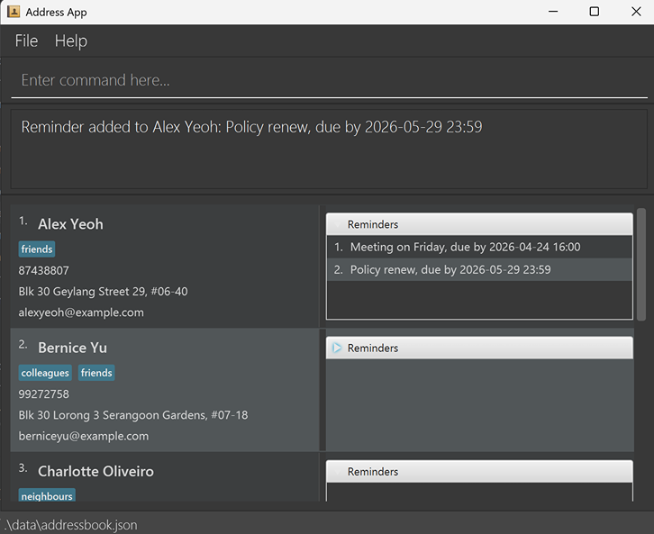

# FinHub User Guide

FinHub is a **desktop app that helps insurance agents manage client information efficiently. It is optimized for use via a Line Interface** (CLI) while still having the benefits of a Graphical User Interface (GUI). If you can type fast, FinHub can get your client management tasks done faster than traditional GUI apps.

<!-- * Table of Contents -->
<page-nav-print />

--------------------------------------------------------------------------------------------------------------------

## Quick start

1. Make sure you have Java `17` or above installed in your computer. 
   **Mac users:** Make sure you have the precise JDK version
   listed [here](https://se-education.org/guides/tutorials/javaInstallationMac.html).

1. Download the latest `.jar` file from [here](https://github.com/AY2526S1-CS2103T-F09-1/tp/releases).

1. Copy the file to the folder you want to use as the _home folder_ for your AddressBook.

1. Open a command terminal, `cd` into the folder you put the jar file in, and use the `java -jar FinHub.jar`
   command to run the application. 
   A window like the one below will appear after a few seconds. Note how the app contains some sample data. 
   

1. Type the command in the command box and press Enter to execute it. e.g. typing **`help`** and pressing Enter will
   open the help window. 
   Some example commands you can try:

    * `list` : Lists all contacts.

    * `add n/John Doe p/98765432 e/johnd@example.com a/John street, block 123, #01-01` : Adds a contact named `John Doe`
      to the Address Book.

    * `delete 3` : Deletes the 3rd contact shown in the current list.

    * `clear` : Deletes all contacts.

    * `exit` : Exits the app.

    * `reminder 2 h/Meeting on Friday d/2026-04-24 16:00` : Adds a reminder with header `Meeting on Friday` to client
      index 2.

1. Refer to the [Features](#features) below for details of each command.

--------------------------------------------------------------------------------------------------------------------

## Features

<box type="info" seamless>

**Notes about the command format:** 

* Words in `UPPER_CASE` show parameters you need to fill in. 
  e.g. in `add n/NAME`, `NAME` is a parameter which can be used as `add n/John Doe`.

* Items in square brackets are optional. 
  e.g `n/NAME [t/TAG]` can be used as `n/John Doe t/friend` or as `n/John Doe`.

* Items with `…`​ after them can be used multiple times including zero times. 
  e.g. `[t/TAG]…​` can be used as ` ` (i.e. 0 times), `t/friend`, `t/friend t/family` etc.

* Parameters can be in any order. 
  e.g. if the command specifies `n/NAME p/PHONE_NUMBER`, `p/PHONE_NUMBER n/NAME` is also acceptable.

* Extra parameters for commands that do not take in parameters (such as `help`, `list`, `exit` and `clear`) will be
  ignored. 
  e.g. if the command specifies `help 123`, it will be interpreted as `help`.

* If you are using a PDF version of this document, be careful when copying and pasting commands that span multiple lines
  as space characters surrounding line-breaks may be omitted when copied over to the application.
  </box>

 

### Viewing help : `help`

Shows a message explaining how to access the help page.

Format: `help`

 

### Adding a person : `add`

Adds a person to the address book.

Format: `add n/NAME p/PHONE_NUMBER e/EMAIL a/ADDRESS [t/TAG]…​ [ip/INSURANCE_POLICY]`

<box type="tip" seamless>

**Tip:** A person can have any number of tags (including 0)
</box>

Examples:

* `add n/John Doe p/98765432 e/johnd@example.com a/John street, block 123, #01-01`
* `add n/Betsy Crowe t/friend e/betsycrowe@example.com a/Newgate Prison p/1234567 t/criminal ip/AIB LifePlan`

 

### Listing all persons : `list`

Shows a list of all persons in the address book.

Format: `list`

 

### Listing all archived clients : `archivelist`

Shows a list of all archived clients in the address book.

Format: `archivelist`

 

### Listing all active clients : `activelist`

Shows a list of all clients in the address book.

Format: `activelist`

 

### Editing a person : `edit`

Edits an existing person in the address book.

Format: `edit INDEX [n/NAME] [p/PHONE] [e/EMAIL] [a/ADDRESS] [t/TAG]…​ [ip/INSURANCE_POLICY]`

* Edits the person at the specified `INDEX`.
* The index refers to the index number shown in the displayed person list.
* The index **must be a positive integer** 1, 2, 3, …​
* At least one of the optional fields must be provided.
* Existing values will be updated to the input values.
* When editing tags, the existing tags of the person will be removed i.e adding of tags is not cumulative.
* You can remove all the person’s tags by typing `t/` without
  specifying any tags after it.

Examples:

* `edit 1 p/91234567 e/johndoe@example.com` Changes the first person’s phone number to `91234567`
  and email to `johndoe@example.com` respectively.
* `edit 2 n/Betsy Crower t/` Changes the second person’s name to `Betsy Crower` and clears all existing tags.

 

### Locating persons by name: `find`

Finds persons whose names contain any of the given keywords.

Format: `find KEYWORD [MORE_KEYWORDS]`

* The search is case-insensitive. e.g `hans` will match `Hans`
* The order of the keywords does not matter. e.g. `Hans Bo` will match `Bo Hans`
* Only the name is searched.
* Only full words will be matched e.g. `Han` will not match `Hans`
* Persons matching at least one keyword will be returned (i.e. `OR` search).
  e.g. `Hans Bo` will return `Hans Gruber`, `Bo Yang`

Examples:

* `find John` returns `john` and `John Doe`
* `find alex david` returns `Alex Yeoh`, `David Li` 
  

 

### Deleting a person : `delete`

Deletes the specified person from the address book.

Format: `delete INDEX`

* Deletes the person at the specified `INDEX`.
* The index refers to the index number shown in the displayed person list.
* The index **must be a positive integer** 1, 2, 3, …​

Examples:

* `list` followed by `delete 2` deletes the 2nd person in the address book.
* `find Betsy` followed by `delete 1` deletes the 1st person in the results of the `find` command.

 

### Adding a reminder : `reminder`

Adds a reminder to the specified person from the address book.

Format: `reminder INDEX h/HEADER d/DEADLINE`

* Adds a reminder to the person at the specified `INDEX`.
* The index refers to the index number shown in the displayed person list.
* The index **must be a positive integer** 1, 2, 3, …​
* Both the header and deadline must be provided.
* Only one reminder can be added at a time.
* More than one reminder can be added to each person.

Examples:

* `reminder 1 h/Meeting on Friday d/2026-04-24 16:00`
* `reminder 2 h/Meeting on Saturday d/2026-06-24 18:00`

 

### Deleting a reminder : `rDelete`

Deletes a reminder from a specified person from the address book.

Format: `rDelete CLIENT_INDEX REMINDER_INDEX`

* Deletes the reminder at the specified `REMINDER_INDEX` of the specified person at `CLIENT_INDEX`.
* The indices refer to the index number shown in the displayed person list.
* The indices **must be positive integers** 1, 2, 3, …​
* Both the client index and reminder index must be provided.
* Only one reminder can be deleted at a time.

Examples:

* `list` followed by `rDelete 2 1` deletes the 1st reminder of the 2nd person in the address book.
* `find Betsy` followed by `rDelete 1 1` deletes the 1st reminder of the 1st person in the results of the `find`
  command.

 

### Editing a reminder : `rEdit`

Edits a specified reminder from a specified person from the address book with a new reminder.

Format: `rEdit CLIENT_INDEX REMINDER_INDEX h/HEADER d/YYYY-MM-DD HH:mm`

* Edits the reminder at the specified `REMINDER_INDEX` of the specified person at `CLIENT_INDEX`.
* The indices refer to the index number shown in the displayed person list.
* The indices **must be positive integers** 1, 2, 3, …​
* Both the client index and reminder index must be provided.
* Only one reminder will be replaced by the new reminder at a time.

Examples:
* `list` followed by `rEdit 2 1 h/Meeting on Friday d/2026-04-24 16:00` edits the 1st reminder of the 2nd person in the
address book to the given reminder 
* `find Betsy` followed by `rEdit 1 1 h/Meeting on Friday d/2026-04-24 16:00` edits the 1st reminder of the 1st person
in the results of the `find` command to the given reminder

 

### Archiving a person : `archive`

Archives the specified person from the address book.

Format: `archive INDEX`

* Archives the peron at the specified `INDEX`.
* The index refers to the index number shown in the displayed person list.
* The indices **must be positive integers** 1, 2, 3, …​
* Only one person can be archived at a time.

Examples:

* `list` followed by `archive 1` archives the 1st person in the list
* `list` followed by `archive 2` archives the 2nd person in the list

 

### Unarchiving a person : `unarchive`

Unarchive the specified person from the address book.

Format: `unarchive INDEX`

* Unarchives the person at the specified `INDEX`
* The index refers to the index number shown in the archived person list.
* The indices **must be positive integers** 1, 2, 3, …​
* Only one person can be unarchived at a time.

Examples:

* `archivelist` followed by `unarchive 1` unarchives the 1st person in the list
* `archivelist` followed by `unarchive 2` unarchives the 2nd person in the list

 

### Adding a meeting note : `note`

Adds a meeting note to the specified person from the address book.

Format: `note INDEX NOTE`

* Adds a meeting note to the person at the specified `INDEX`.
* The index refers to the index number shown in the displayed person list.
* The index **must be a positive integer** 1, 2, 3, …​
* The note cannot be empty. 
* Only one meeting note can be added at a time.
* More than one meeting note can be added to each person.

Examples:

* `note 1 Client is interested in policy abc`
* `note 2 Client wants to renew policy`

 

### Deleting a meeting note : `nDelete`

Deletes a meeting note from a specified person from the address book.

Format: `nDelete CLIENT_INDEX MEETING_NOTE_INDEX`

* Deletes the meeting note at the specified `MEETING_NOTE_INDEX` of the specified person at `CLIENT_INDEX`.
* The indices refer to the index number shown in the displayed person list.
* The indices **must be positive integers** 1, 2, 3, …​
* Both the client index and meeting note index must be provided.
* Only one meeting note can be deleted at a time.

Examples:

* `list` followed by `nDelete 2 1` deletes the 1st reminder of the 2nd person in the address book.
* `find Betsy` followed by `nDelete 1 1` deletes the 1st meeting note of the 1st person in the results of the `find`
  command.

 

### Starring a person : `star`

Stars the specified person from the address book.

Format: `star INDEX`

* Stars the peron at the specified `INDEX`.
* The index refers to the index number shown in the displayed person list.
* The indices **must be positive integers** 1, 2, 3, …​
* Only one person can be archived at a time.

Examples:

* `list` followed by `star 1` archives the 1st person in the list
* `list` followed by `star 2` archives the 2nd person in the list

 

### Removing Star of a person : `unstar`

Remove the starred status of a specified person from the address book.

Format: `unstar INDEX`

* Removes the starred status of the person at the specified `INDEX`.
* The index refers to the index number shown in the displayed person list.
* The indices **must be positive integers** 1, 2, 3, …​
* Only one person can be unarchived at a time.

Examples:

* `list` followed by `unstar 1` unarchives the 1st person in the list
* `list` followed by `unstar 2` unarchives the 2nd person in the list

 

### Clearing all entries : `clear`

Clears all entries from the address book.

Format: `clear`

 

### Exiting the program : `exit`

Exits the program.

Format: `exit`

 

### Saving the data

AddressBook data are saved in the hard disk automatically after any command that changes the data. There is no need to
save manually.

 

### Editing the data file

AddressBook data are saved automatically as a JSON file `[JAR file location]/data/addressbook.json`. Advanced users are
welcome to update data directly by editing that data file.

<box type="warning" seamless>

**Caution:**
If your changes to the data file makes its format invalid, AddressBook will discard all data and start with an empty
data file at the next run. Hence, it is recommended to take a backup of the file before editing it. 
Furthermore, certain edits can cause the AddressBook to behave in unexpected ways (e.g., if a value entered is outside
the acceptable range). Therefore, edit the data file only if you are confident that you can update it correctly.
</box>

 

### Archiving data files `[coming in v2.0]`

_Details coming soon ..._

--------------------------------------------------------------------------------------------------------------------

## FAQ

**Q**: How do I transfer my data to another computer? 
**A**: Install the app in the other computer and overwrite the empty data file it creates with the file that contains
the data of your previous AddressBook home folder.

--------------------------------------------------------------------------------------------------------------------

## Known issues

1. **When using multiple screens**, if you move the application to a secondary screen, and later switch to using only
   the primary screen, the GUI will open off-screen. To fix this, delete the `preferences.json` file created by the
   application, then restart the app.
2. **If you minimize the Help Window** and then run the `help` command (or use the `Help` menu, or the keyboard shortcut
   `F1`) again, the original Help Window will remain minimized, and no new Help Window will appear. To fix this, manually restore the minimized Help Window.

--------------------------------------------------------------------------------------------------------------------

## Command summary

| Action                                                       | Format, Examples                                                                                                                                                      |
|--------------------------------------------------------------|-----------------------------------------------------------------------------------------------------------------------------------------------------------------------|
| [**Add**](#adding-a-person-add)                              | `add n/NAME p/PHONE_NUMBER e/EMAIL a/ADDRESS [t/TAG]…​`   e.g., `add n/James Ho p/22224444 e/jamesho@example.com a/123, Clementi Rd, 1234665 t/friend t/colleague` |
| [**Delete**](#deleting-a-person-delete)                      | `delete INDEX`  e.g., `delete 3`                                                                                                                                   |
| [**Edit**](#editing-a-person-edit)                           | `edit INDEX [n/NAME] [p/PHONE_NUMBER] [e/EMAIL] [a/ADDRESS] [t/TAG]…​`  e.g.,`edit 2 n/James Lee e/jameslee@example.com`                                           |  
| [**Clear**](#clearing-all-entries-clear)                     | `clear`                                                                                                                                                               |
| [**Find**](#locating-persons-by-name-find)                   | `find KEYWORD [MORE_KEYWORDS]`  e.g., `find James Jake`                                                                                                            |
| [**List**](#listing-all-persons-list)                        | `list`                                                                                                                                                                |
| [**archivelist**](#listing-all-archived-clients-archivelist) | `archivelist`                                                                                                                                                         |
| [**activelist**](#listing-all-active-clients-activelist)     | `activelist`                                                                                                                                                          |
| [**Reminder**](#adding-a-reminder-reminder)                  | `reminder INDEX h/HEADER d/DEADLINE`  e.g., `reminder 1 h/Meeting on Friday d/2026-04-24 16:00`                                                                    |
| [**rDelete**](#deleting-a-reminder-rdelete)                  | `rDelete CLIENT_INDEX REMINDER_INDEX`  e.g., `rDelete 2 1`                                                                                                         |
| [**rEdit**](#editing-a-reminder-redit)                       | `rEdit CLIENT_INDEX REMINDER_INDEX h/HEADER d/DEADLINE`  e.g., `rEdit 1 1 h/Meeting on Friday d/2026-04-24 16:00`                                                  |
| [**Archive**](#archiving-a-person-archive)                   | `archive INDEX`  e.g., `archive 1`                                                                                                                                 |
| [**Unarchive**](#unarchiving-a-person-unarchive)             | `unarchive INDEX`  e.g., `unarchive 1`                                                                                                                             |  
| [**Note**](#adding-a-meeting-note-note)                      | `note INDEX NOTE`  e.g., `note 1 Client wants to know about policy abc`                                                                                            |
| [**nDelete**](#deleting-a-meeting-note-ndelete)              | `nDelete CLIENT_INDEX MEETING_NOTE_INDEX`  e.g., `nDelete 1 1`                                                                                                     |
| [**Star**](#starring-a-person-star)                          | `star INDEX`  e.g., `star 1`                                                                                                                                       |
| [**Unstar**](#removing-star-of-a-person-unstar)              | `unstar INDEX`  e.g., `unstar 1`                                                                                                                                   |  
| [**Help**](#viewing-help-help)                               | `help`                                                                                                                                                                |
